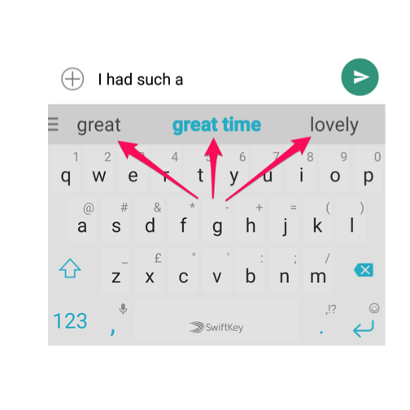
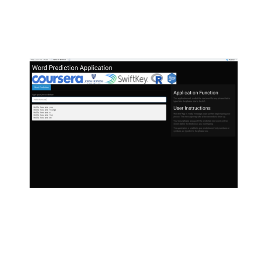
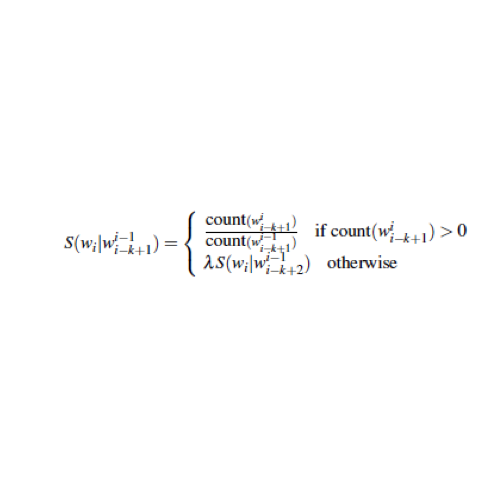

Word Prediction App
========================================================
author: Ashley Campisano
date: March 8, 2020
autosize: true

Assignment Overview
========================================================

***
- This application (<https://acampisano.shinyapps.io/Data-Science-Capstone/>) was created for the John Hopkins Data Science Certification Capstone project
- The objective of this project was to create an application that would predict the next word for any given input phrase using Natural Language Processing (NLP)
- A common example of NLP is the predictive typing used while typing on smartphones (example to the left)

The Application
========================================================

***
How to Use the Application

- The user interface of the Application was designed to be easy to understand and use
- To have a word predicted, wait until the app is ready and begin typing in a phrase into the text box
- The application will use Natural Language Processing to predict the 5 most likely words to complete the typed in phrase

How the Application Works
========================================================
left: 30%

***
- The training data used for this model was provided by Swiftkey and contains phrases from US Blogs, News and Tweets. The data was cleaned and then tokenized into n grams to allow for model processing
- The Application uses a n-gram modeling method called Stupid Backoff (function formula to the left) which was developed by Google linguists
- When a user types a phrase into the application, the model will try to find a match available using the highest n-gram model available (starting at 4 grams) and then "backs" off to lower orders (3 gram, 2 gram, etc) if it does not find a match
- The Backoff model is useful for language prediction because it accounts for when a phrase is typed in that is not part of the training data

Additional Details and Resources
========================================================
Please see below for how to access the application and also the code that powers the application. Additionally, I have provided some resources that were incredibly helpful in my research on NLP.

Application Links:
- Application Link: <https://acampisano.shinyapps.io/Data-Science-Capstone/>
- Github Link: <https://github.com/AshleyCampisano/Data-Science-Capstone>

Project Resources:
- John Hopkins Data Science Capstone Course: <https://www.coursera.org/learn/data-science-project/home/welcome>
- NLP Model Explanation: <https://medium.com/@davidmasse8/predicting-the-next-word-back-off-language-modeling-8db607444ba9>
- Guide to NLP: <https://towardsdatascience.com/a-practitioners-guide-to-natural-language-processing-part-i-processing-understanding-text-9f4abfd13e72>

